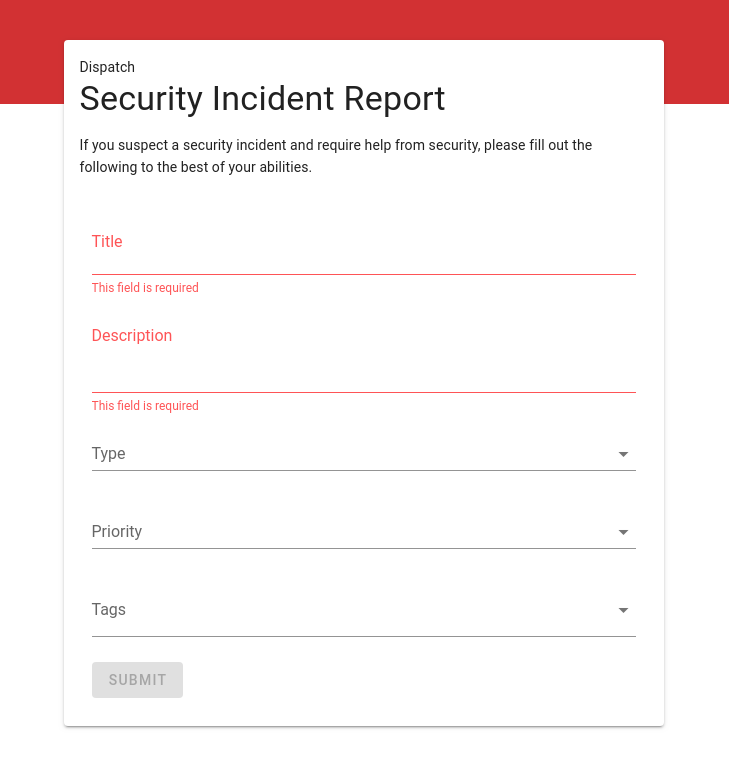
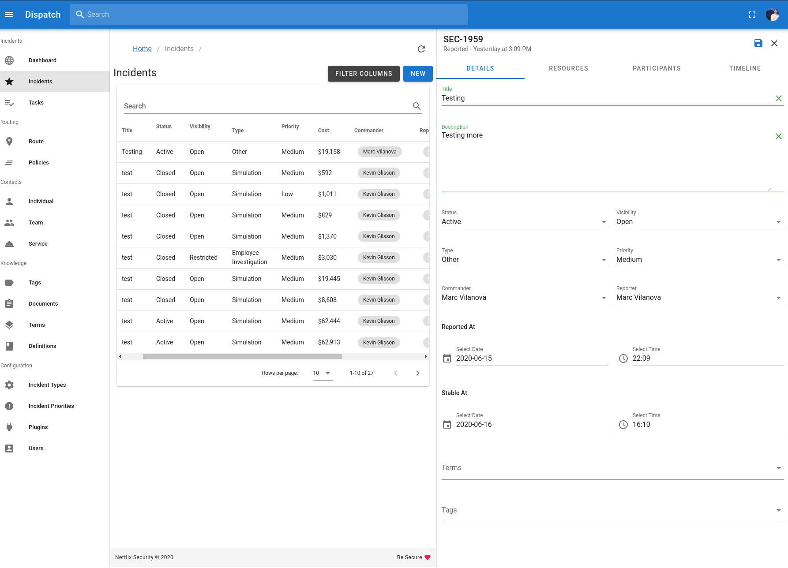

# About

### What's Dispatch?

Put simply, Dispatch is:

> All of the ad-hoc things you’re doing to manage incidents today, done for you, and a bunch of other things you should've been doing, but have not had the time!

Dispatch helps us effectively manage security incidents by deeply integrating with existing tools used throughout an organization \(Slack, GSuite, Jira, etc.,\) Dispatch is able to leverage the existing familiarity of these tools to provide orchestration instead of introducing another tool.

This means you can let Dispatch focus on creating resources, assembling participants, sending out notifications, tracking tasks, and assisting with post-incident reviews; allowing you to focus on actually fixing the issue!

   

## Project resources

* [Dispatch Blog Post](https://medium.com/@NetflixTechBlog/introducing-dispatch-da4b8a2a8072)
* [Source Code](https://github.com/netflix/dispatch)
* [Issue tracker](https://github.com/netflix/dispatch/issues)
* [Docker](https://github.com/Netflix/dispatch-docker)

