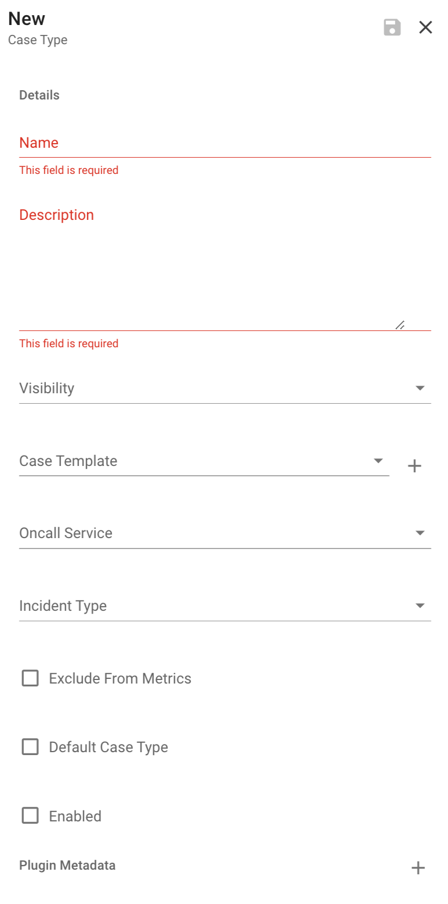

## Case Types

Dispatch allows you to categorize your cases by defining case types and to map them to various Dispatch resources (e.g. templates, oncall services, and incident types).

**Name:** The name of the case type presented to the user.

**Description:** The description of the case type presented to the user.

**Visibility:** Allows you to specify how visible a case of this type will be. Note: this option is currently not being leveraged.

**Case Template:** Allows you to create a new or map an existing case document template to the case type.

**Oncall Service:** Allows you to map an existing oncall service that will be used to determing the owner of the case.

**Incident Type:** The type of incident that will be created and linked to the case if a case of this type is moved to the Escalated status.

**Exclude From Metrics:** Enable this setting to exclude all cases of this type from metrics (e.g., test cases).

**Default Case Type:** If the creator of a case does not provide a case type, a default case type is used. Enable this setting to make this case type the default.

**Enabled:** Whether the case type is enabled or not.

**Plugin Metadata:** Allows you to define and pass metadata key-value pairs to plugins. For example, create issues in different Jira projects based on the case type.
