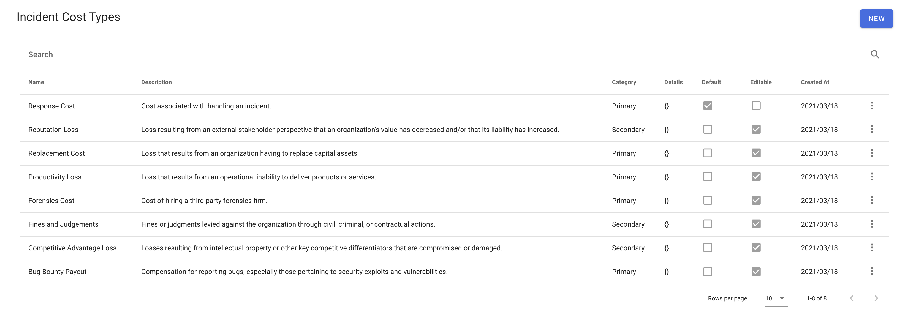

## Incident Cost Types

Dispatch allows you to define incident cost types. These types can then be used when editing and adding costs to incidents. Dispatch calculates the incident response cost for all incidents every 5 minutes and saves the result to the default incident cost type. We recommend creating at least the response cost type and making it the default to take advantage of this useful feature. You can find the list of incident cost types (or Forms of Loss) recommended by the Factor Analysis of Information Risk (FAIR) Institute [here](https://www.fairinstitute.org/blog/a-crash-course-on-capturing-loss-magnitude-with-the-fair-model).

**Name:** The name of the incident cost type presented to the user.

**Description:** The description of the incident cost type presented to the user.

**Category:** The Factor Analysis of Information Risk (FAIR) Form of Loss (FOL) or category.

**Default:** Whether the incident cost type is the default or not.

**Editable:** Whether this cost type can be edited or not.
