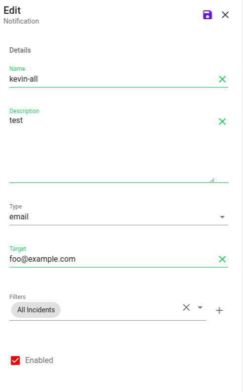

## Notification

Notifications allow you to specify who should be sent incident notifications (in addition to those directly involved).

**Name:** The name you wish to present to the user.

**Description:** The description presented to the user when the notification is viewed.

**Type:** The plugin type that should be used to send the notification (email or conversation).

**Target:** The recipient of the notification whatever makes sense for the selected plugin type. (e.g. a slack conversation name or an email address.)

**Filters:** The search filter which will be used to determine when a notification should be sent.

**Enabled:** By default, users can't invoke workflows. Activate the "Enabled" setting to allow the use of the workflow.
