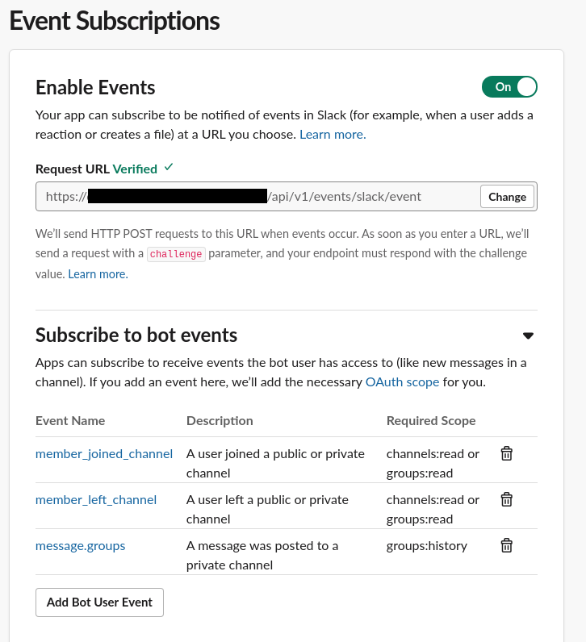
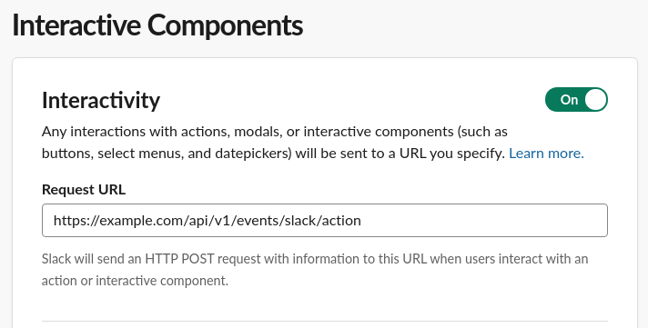
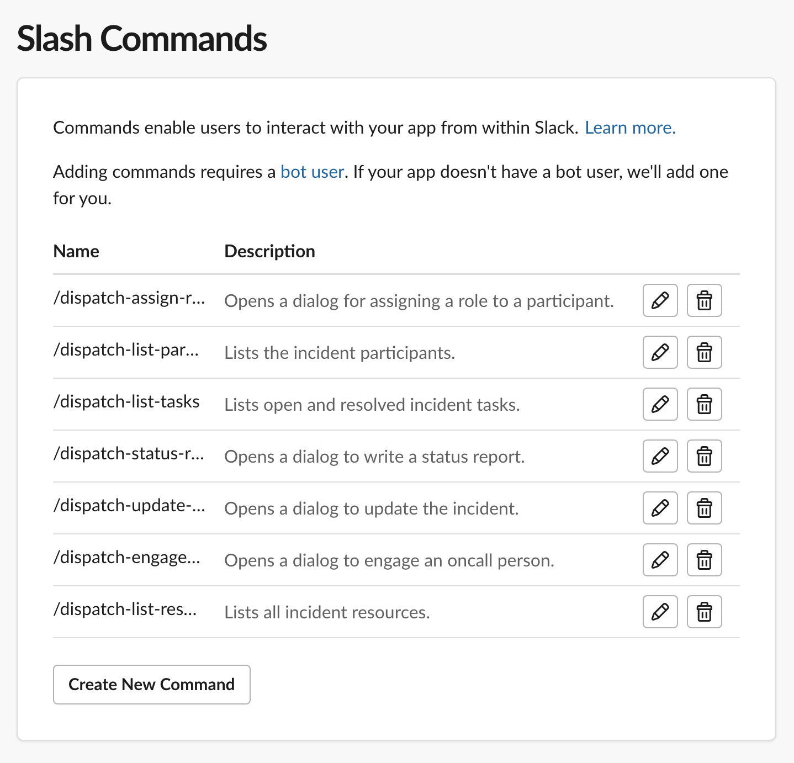
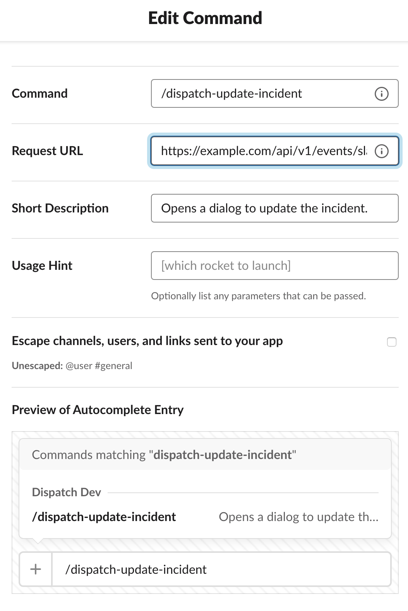
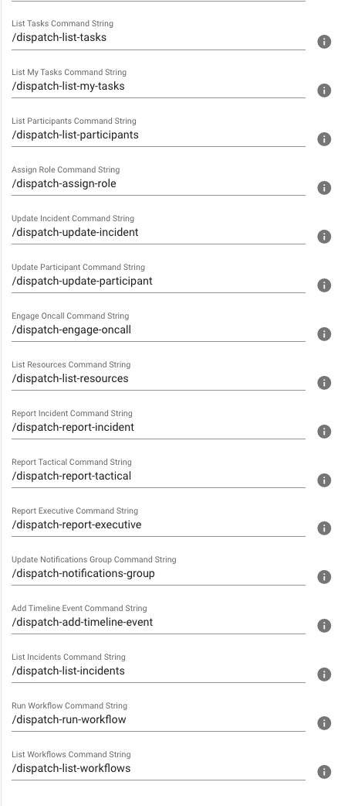
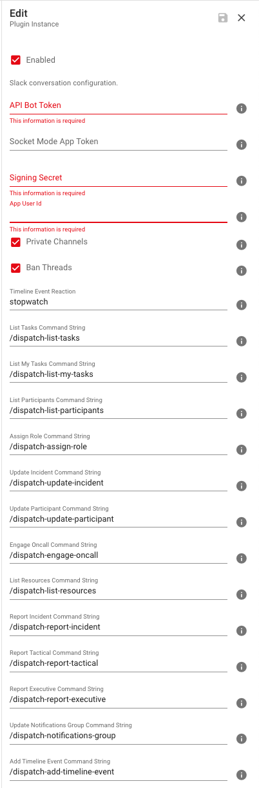
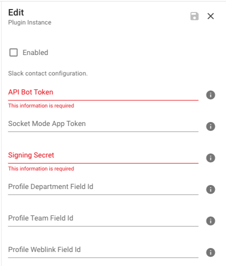

# Configuring Slack

Dispatch ships with support for Slack. Below is how to configure the Slack plugin to work with `Dispatch`.

## Events Mode vs Socket Mode

Dispatch supports both [Events Mode](https://api.slack.com/events-api) and [Socket Mode](https://api.slack.com/apis/connections/socket).

Which mode should you choose?

- If Dispatch will be listening on a public static HTTP endpoint, then we recommend using **events mode**.
- If Dispatch will be deployed behind a corporate firewall or you have security concerns, then we recommend using **socket mode**.

See the [Dispatch Configuration](#dispatch-configuration) section below for further details on the variables.

### Events Mode

Events mode requires specific URL mapping that must be **publicly** accessible:

- `Dispatch` receives general events at the `/api/v1/<organization>/events/slack/event` endpoint (e.g. member joins channel, reactions).
- `Dispatch` receives command events at the `/api/v1/<organization>/events/slack/command` endpoint (`/dispatch-*` commands)
- `Dispatch` receives action events at the `/api/v1/<organization>/events/slack/action` endpoint (dialogs and modals).

### Socket Mode

To enable socket mode, add the socket mode app token in the `Socket Mode App Token` section of the `Slack Plugin - Conversation Management` and the `Slack Plugin - Contact Information Resolver` plugins Dispatch Web UI under Settings -> Project -> Plugins.

Socket mode does not require the mapping of endpoints. These values are ignored in socket mode.

Socket mode requires that you run a separate process (from the main Dispatch webserver) to receive WebSocket events.

The easiest way to run this process is via the following CLI command:

```
dispatch server slack <organization> <project>
```

This process has to be daemonized similarly to the Dispatch webserver.

## Slack Configuration

You will need to set the following configuration settings for your Slack app in the [Slack API Web UI](https://api.slack.com/apps) for both `events mode` and `socket mode`.

### Event Subscriptions

To enable Dispatch to process Slack events, ensure your bot is subscribed to the following events:



### Interactivity

To enable Dispatch to generate interactive components such as dialogs and modals, ensure that the `Request URL` points to the events action API endpoint of the Dispatch server at `/api/v1/<organization>?events/slack/action`.



### Slash Commands

To enable Dispatch's slash commands, you must add them to your Slack app first. Ensure that the `Command` field in the Slack API Web UI matches the name of the command name in the Slack plugin in the Dispatch Web UI and that the `Request URL` points to the events command API endpoint of the Dispatch server at `/api/v1/<organization>/events/slack/command`.







### OAuth & Permissions

The `Bot User OAuth Access Token` is used to issue queries against the Slack API.

#### Scopes

The following are the bot and user scopes required for the Dispatch Slack App to function correctly.

**Bot Token Scopes**

```text
channels:read
chat:write
commands
files:read
groups:history
groups:read
groups:write
im:history
im:read
im:write
mpim:history
mpim:read
mpim:write
pins:write
reactions:read
reactions:write
team:read
users:read
users:read.email
users.profile:read
users:write
```

**User Token Scopes**

```text
channels:read
groups:history
groups:read
```

## Dispatch Configuration

The Dispatch Slack plugins for conversation management and resolving contact information are configured in the Dispatch Web UI under Settings ->  Project -> Plugins. Add the desired plugin(s) using the `NEW` button and then edit the plugin(s) configuration by clicking on the three vertical dots.

### Conversation Management Plugin

#### API Bot Token

> The Slack app's bot token necessary to communicate with the Slack API. Slack refers to this as your "Bot User OAuth Access Token" and should be revealed to app collaborators when installing the app.

#### Socket Mode App Token

> The Slack app's socket mode token provided when socket mode is enabled to authenticate to the WebSocket API. Its value will be ignored if socket mode is not used.

#### Signing Secret

> The secret used to verify signatures included on each HTTP request that Slack sends. Slack refers to this as your "Signing Secret."

#### App User Id

> The Slack app's bot user id so that Dispatch can filter events generated by the app's user \(e.g., message posted in the channel\). You can use the [auth.test](https://api.slack.com/methods/auth.test/test) endpoint and the app's bot token \(`xoxb-*`\) to get the bot user-id \(`UXXXXXXXX`\)."

#### Private Channels

> Whether you want Dispatch to create public or private incident Slack channels.

#### Ban Threads

> Whether you want Dispatch to allow or ban threaded messages in incident channels.

#### Timeline Event Reaction

> The reaction used for adding Slack messages posted in the incident channel to the incident timeline.

#### Command Strings

> The name of the slash commands that your Slack app will expose.



You can override their values if you wish to do so. Included below are their descriptions for easy cut & paste into your Slack app slash commands set-up.

| Command Name                   | Command Description                                                                                             |
| ------------------------------ | ----------------------------------------------------------------------------------------------------------------|
| `/dispatch-add-timeline-event` | Opens a dialog to add an event to the incident timeline.                                                        |
| `/dispatch-assign-role`        | Opens a dialog for assigning a role to a participant.                                                           |
| `/dispatch-engage-oncall`      | Opens a dialog to engage an on-call person.                                                                     |
| `/dispatch-list-incidents <organization-slug\|'default'> <project-slug\|'default'>` | Lists current active and stable incidents and closed incidents in the last 24 hours. |
| `/dispatch-list-my-tasks`      | Sends an ephemeral message with the list of your open and resolved incident tasks.                              |
| `/dispatch-list-participants`  | Sends an ephemeral message with the list of incident participants.                                              |
| `/dispatch-list-resources`     | Sends an ephemeral message with the list of all incident resources.                                             |
| `/dispatch-list-tasks`         | Sends an ephemeral message with the list of open and resolved incident tasks.                                   |
| `/dispatch-list-workflows`     | List workflows previously run during this incident.                                                             |
| `/dispatch-report-executive`   | Opens a dialog to write an executive report.                                                                    |
| `/dispatch-report-incident <organization-slug\|'default'>` | Opens a dialog to report an incident. This command can be run from non-incident channels where the Dispatch bot is a member. |
| `/dispatch-report-tactical`    | Opens a dialog to write a tactical report.                                                                      | 
| `/dispatch-run-workflow`       | Run a workflow and associate artifacts with this incident.                                                      |
| `/dispatch-update-incident`    | Opens a dialog to update the incident.                                                                          |
| `/dispatch-notifications-group` | Opens a dialog to edit the notifications group.                                                                |
| `/dispatch-update-participant` | Opens a dialog to update participant metadata.                                                                  |

### Contact Information Resolver Plugin

#### API Bot Token

> The Slack app's bot token necessary to communicate with the Slack API. Slack refers to this as your "Bot User OAuth Access Token" and should be revealed to app collaborators when installing the app.

#### Socket Mode App Token

> The Slack app's socket mode token provided when socket mode is enabled to authenticate to the WebSocket API. Its value will be ignored if socket mode is not used.

#### Signing Secret

> The secret used to verify signatures included on each HTTP request that Slack sends. Slack refers to this as your "Signing Secret."

#### Profile Department Field Id

> The profile field ID where Department is mapped.

#### Profile Team Field Id

> The profile field ID where the Team is mapped.

#### Profile Weblink Field Id

> The profile field ID where the weblink is mapped.


