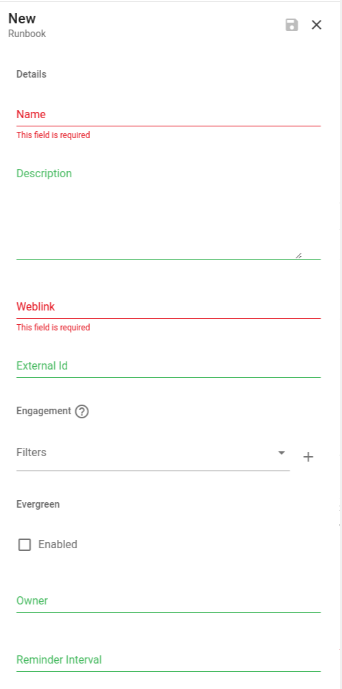

## Runbooks

Runbooks allow for Dispatch users to provide documents dynamically to incident participants that may be useful during an incident.

Where templates are used to document the state of the incident runbooks typically document steps to take to resolve an incident.

How closely these two ideas are related depends on the incident and how your organization runs it's incidents.

Today, there are two types of runbooks although their actual usage is the same.

- Incident
- Investigation

### Engagement

Runbook documents are dymanically matched to an incident based on their engagement filter. Similar to notification's a user can define for which incidents a document should be recommended to incident participants.

On incident creation (or when an important incident variable changes e.g. incident type) Dispatch will send the incident channel a document suggestion notification.

**Name:** Name of the document.

**Description:** Short description of the document.

**Weblink:** A hyperlink representing the document.

**ID:** The external ID that is used to fetch the document.

### Evergreen

Enabling evergreen for a runbook instructs Dispatch to send an email reminder to the runbook owner, informing them that they should check to ensure that the runbook in question is up to date.
