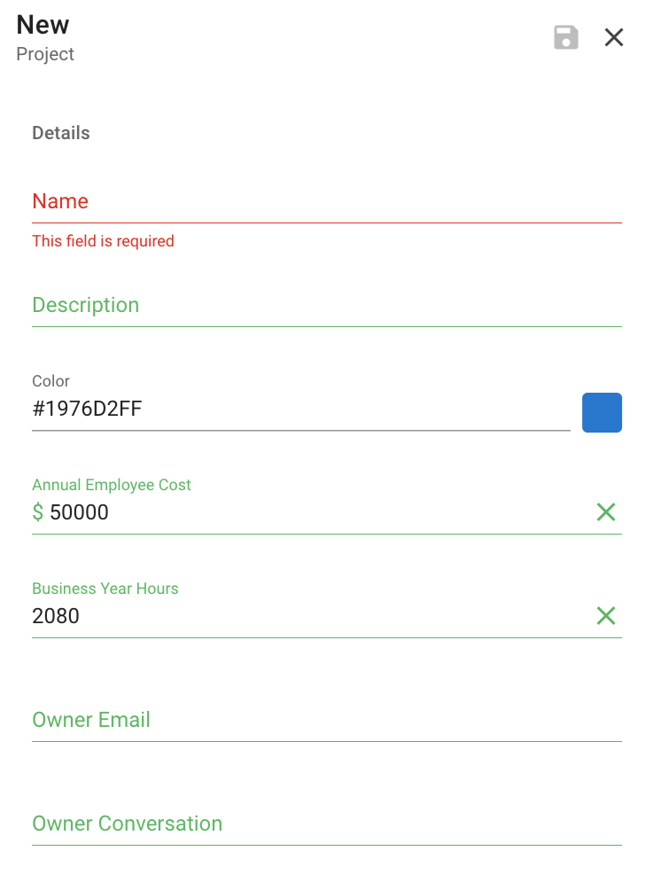

# Projects

Every incident within Dispatch is tied to a project. The project and its resources/configuration determine how the incident is run. This allows multiple teams to use Dispatch in different ways.

From having their own incident types and priorities to providing the team with a view of their incident metrics. Projects drive this scoping of incidents.

### When should I create a new project vs using an existing one?

Generally, you would create a new project when the teams involved have very little overlap when handling incidents.

For example, you might create a `security` project for the handling of all security related incidents and a `reliability` project for all outage related incidents.

**Name:** The name you wish to give your project.

**Description:** A brief description of the project.
