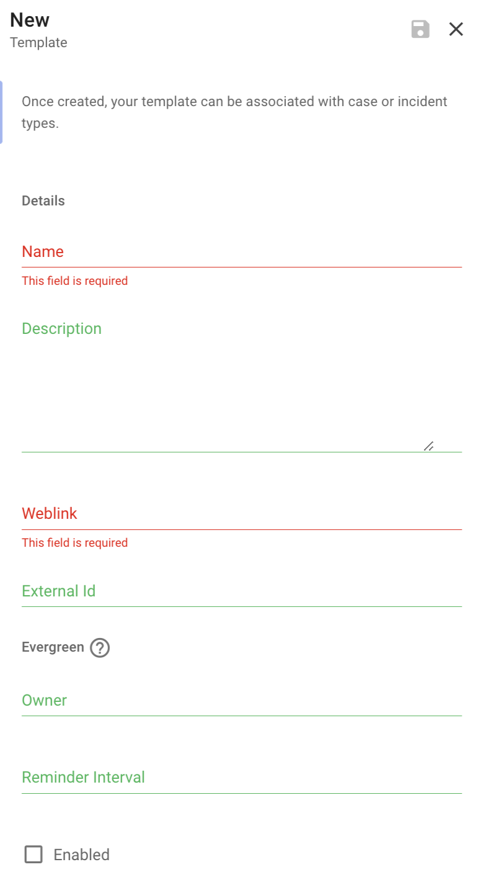

## Templates

Templates are used by Dispatch to create case or incident specific documentation. These templates are copied and filled out to the best of Dispatch's abilities. After their creation, they are normal documents that are associated to your case or incident and can be used for collaborating and capturing facts and findings.

There are several types of templates that Dispatch supports:

- Case
- Incident
- Executive
- Review
- Tracking

**Name:** Name of the template.

**Description:** Description of the template.

**Weblink:** The weblink to the template.

**External Id:** External identifier for the document template. Used for API integration (e.g. Google doc file id). Typically, the unique id in the weblink.

Enabling evergreen for a template instructs Dispatch to send an email reminder to the template owner informing them that they should review the template to ensure that the template is up to date.

**Evergreen Owner:** The email address representing the owner of this document template.

**Evergreen Reminder Interval:** Number of days that should elapse between reminders sent to the document template owner.

### Case Template

A copy of this template is created for each new case on case creation. It contains the current state of the case and is used by the case owner/ assignee to capture facts and findings.

- [Example Case Document](https://docs.google.com/document/d/1g1cl9liXG8US0eBnrZYRaeWa7Ek_hoZJ5PPadas44vI)

#### Template Variables

The following is a list of available variables that Dispatch will attempt to resolve on document creation. Note: we do not currently re-resolve these.

NOTE: All variables must be enclosed in a `{{}}`

- `case_name` - The case's name
- `case_title` - The cases's title
- `case_description` - The case's description
- `case_resolution` - The case's resolution
- `case_owner` - The case's owner
- `case_type` - The case's type
- `case_severity` - The case's severity
- `case_priority` - The case's priority
- `case_status` - The case's status
- `case_storage_weblink` - Link to the storage resource

### Incident Template

A copy of this template is created for each new incident on incident creation. It contains the current state of the incident and is used by incident participants to share knowledge about the incident.

- [Example Incident Document](https://docs.google.com/document/d/1fv--CrGpWJJ4nyPR0N0hq4JchHJPuqsXN4azE9CGQiE)

#### Template Variables

The following is a list of available variables that Dispatch will attempt to resolve on document creation. Note: we do not currently re-resolve these.

NOTE: All variables must be enclosed in a `{{}}`

- `name` - The name of the incident
- `title` - The incident's title
- `description` - The incident's description
- `resolution` - The incident's resolution
- `commander_fullname` - The current commander's name
- `type` - The incident's type
- `priority` - The incident's priority
- `status` - The incident's status
- `conversation_weblink` - Link to the conversation resource (if any)
- `conference_weblink` - Link to the conference resource (if any)
- `storage_weblink` - Link to the storage resource (if any)
- `document_weblink` - Link to the incident document (if any)
- `ticket_weblink` - Link to the incident ticket (if any)

### Executive Template

Often during an incident an executive report needs to be drafted that provides a high-level overview of the incident and the current actions that are being carried out. A copy of this template will be created, filled, and stored in the incident storage every time a new executive report is drafted.

- [Example Executive Report](https://docs.google.com/document/d/1dab6k14p5ageo5B_d1YlB_zS9hMGHDMXy9RUbIZous4)

### Review Template

A copy of this template is automatically created when an incident is marked as stable. It is used by the incident commander and participants for reconciling any incident learnings, discussions, or post-incident tasks.

- [Example Incident Review Document](https://docs.google.com/document/d/1MkCTyheZRtKzMxOBhLgh3PrvarERA9Bwo0joM7D9tmg)

### Tracking Template

Some incidents require the tracking of multiple assets, this template is a simple spreadsheet that allows incident participants to collaborate on tabular data.

- [Example Incident Tracking Sheet](https://docs.google.com/spreadsheets/d/1Odk4KlL7uMF_yd7OvTOCaPWmtTA_WzFBIA4lMeU5cGY)

### Template Association

Case and incident templates can be associated to their corresponding types. This allows our templates to closely match a given case or incident type and provide additional context and direction for those given types.

Additionally, templates can be associated with multiple case or incident types, if for example, you only want to use one template.

