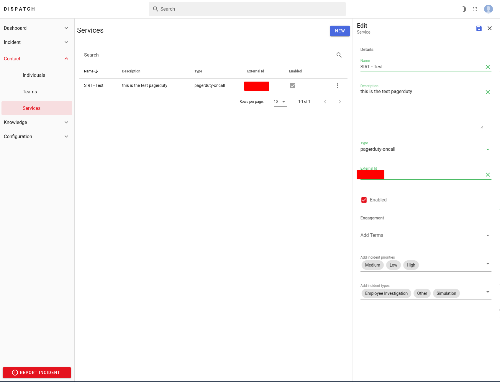

# Configuring PagerDuty


Dispatch ships with support for resolving oncall schedules via the PagerDuty API. This plugin is not required for core functionality, however a plugin of type `oncall` must always be enabled. The current implementation expects a schedule to be associated with the escalation policy. 


### Env Configuration

Add the following env vars to your `.env` file.

## `PAGERDUTY_API_KEY` \[Required. Secret: True\]

> PagerDuty API key.

## `PAGERDUTY_API_FROM_EMAIL` \[Required\]

> Email to be added to all outgoing incident pages.

## Oncall Service Configuration

Go to /services on your Web server running Dispatch and add a new service. Select type `pagerduty-oncall` and add your PagerDuty Service ID in the external id field.

