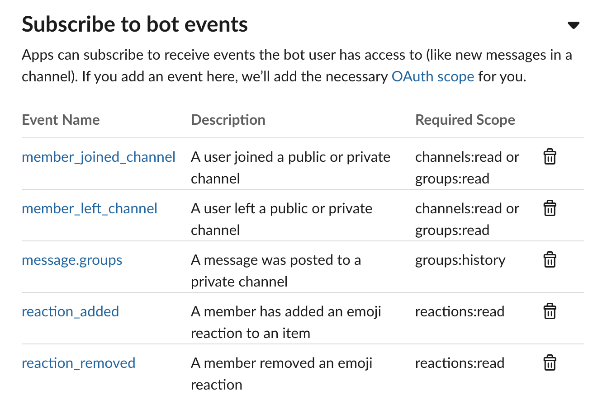
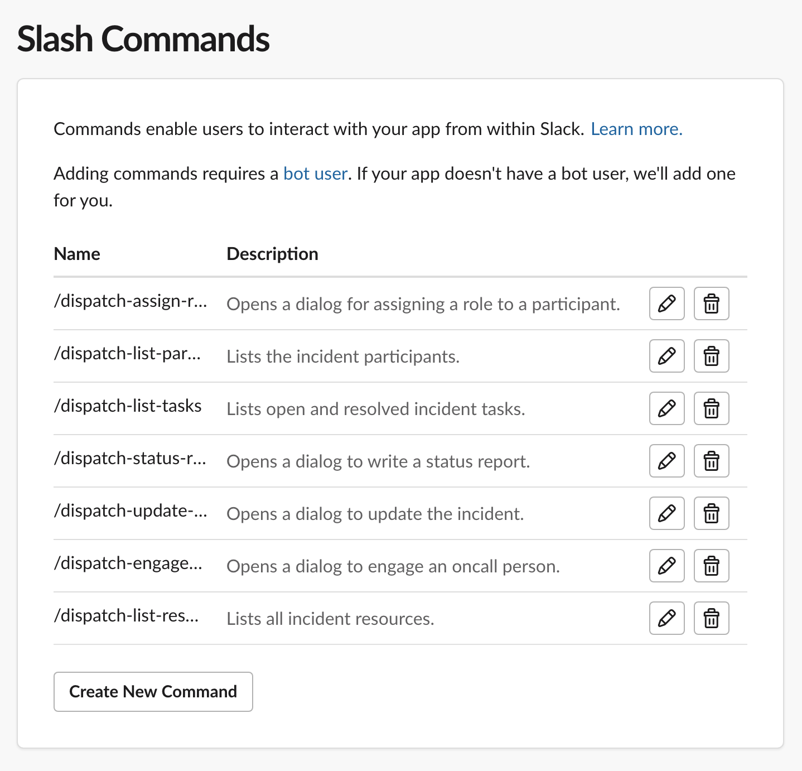
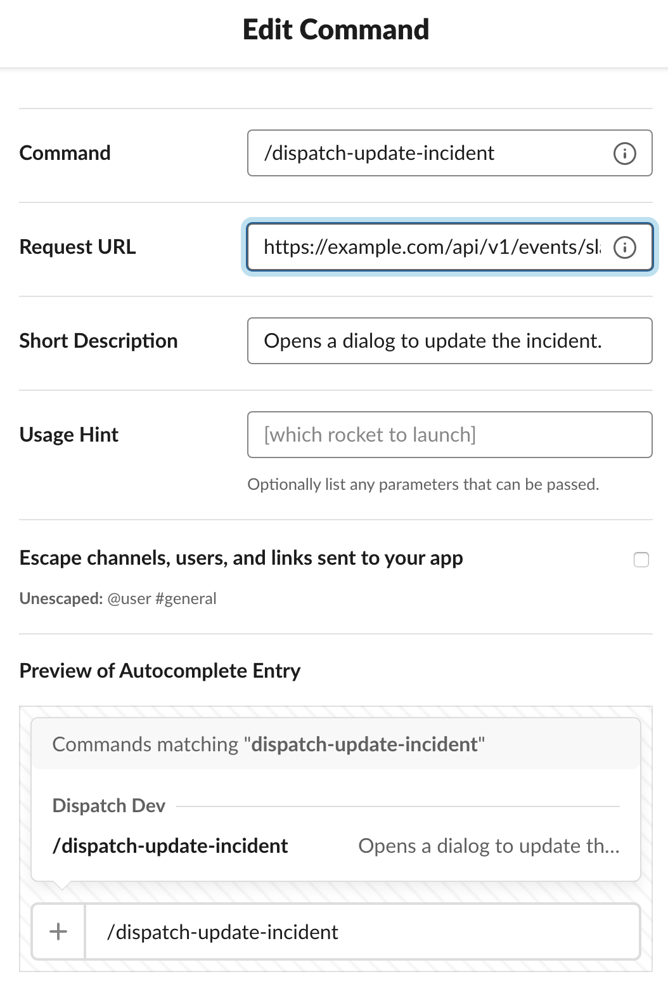

# Configuring Slack


Dispatch ships with support for Slack. Below is how to configure the Slack plugin to work with `Dispatch`.

Dispatch supports both the [Event Mode](https://api.slack.com/events-api) and [Socket Mode](https://api.slack.com/apis/connections/socket).

Which mode should you choose?

- If you have Dispatch deployed behind a firewall, use **socket mode**
- If you are deploying Dispatch publically, use **event mode**

## Events Mode

To enable event mode:

- Ensure that the following configuration items are set:
  - `SLACK_SIGNING_SECRET`
  - `SLACK_API_BOT_TOKEN`

Additional, event mode requires specific url mapping that must be **publically** available:

- `Dispatch` receives general events at the `/api/v1/events/slack/event` endpoint (reactions).
- `Dispatch` receives command events at the `/api/v1/events/slack/command` endpoint (`/dispatch-*` commands)
- `Dispatch` recieves action events at the `/api/v1/events/slack/action` (dialogs and modals) endpoint.

## Socket Mode

To enable socket mode:

- Ensure the following configuration items are set:
  - `SLACK_SOCKET_MODE_APP_TOKEN`

Socket mode does not require the mapping of endpoints. These values are ignored in socket mode.

Socket mode requires that you run a separate process (from the main dispatch webserver) to receive WebSocket events.

The easiest way to run this process is via the command:

```
dispatch server slack
```

This process has to be daemonized similarly to the dispatch webserver.

## Slack Configuration

Both `socket mode` or `event mode` will need to set the following configuration items within the Slack API.

### Event Subscriptions

To enable Dispatch to process Slack events, ensure your bot is subscribed to the following events:



### Interactivity

To enable Dispatch to generate interactive components such as dialogs and modals, ensure that the `Request URL` points to the events action API endpoint of the Dispatch server at `/API/v1/events/slack/action`.


### Slash Commands

To enable Dispatch's slash commands, you must add them to the Slack app first. Ensure that the `Command` field matches the configuration variables in the XXX section \(e.g. `/dispatch-update-incident`\) and that the `Request URL` points to the events command API endpoint of the Dispatch server at `/API/v1/events/slack/command`.





### OAuth & Permissions

The `Bot User OAuth Access Token` is used to issue queries against the Slack API.

#### Scopes

The following are the scopes required for the Dispatch Slack App to function correctly.

**Bot Token Scopes**

```text
channels:read
chat:write
commands
files:read
groups:history
groups:read
groups:write
im:history
im:read
im:write
mpim:history
mpim:read
mpim:write
pins:write
reactions:read
reactions:write
reminders:write
remote_files:read
team:read
users:read
users:read.email
users.profile:read
users:write
```

**User Token Scopes**

```text
channels:read
groups:history
groups:read
```

## Dispatch Configuration

#### `SLACK_WORKSPACE_NAME \[Required. Secret: True\]`

> Specifies the name of the workspace where the Slack app is installed. This variable is typically the subdomain provided by Slack. For example, if your Slack workspace is accessible at `example.slack.com`, you would set your workspace name to `example`.

#### `SLACK_API_BOT_TOKEN` \[Required. Secret: True\]

> The app's bot token necessary to communicate with the Slack API. Slack refers to this as your "Bot User OAuth Access Token" and should be revealed to app collaborators when installing the app.

#### `SLACK_SIGNING_SECRET` \[Required. Secret: True\]

> Secret used to verify signatures included on each HTTP request that Slack sends. Slack refers to this as your "Signing Secret."

#### `SLACK_SOCKET_MODE_APP_TOKEN` \[Required. Secret: True\]

> Socket-specific app token used to authenticate to the WebSocket API.

#### `SLACK_APP_USER_SLUG` \[Required\]

> Specifies the Slack app's bot user id so that Dispatch can filter events generated by the app's user \(e.g., message posted in the channel\). You can use the [auth.test](https://api.slack.com/methods/auth.test/test) endpoint and the app's bot token \(`xoxb-*`\) to get the bot user-id \(`UXXXXXXXX`\)."

#### `SLACK_USER_ID_OVERRIDE` \[Optional. Default: ""\]

> Used during development to funnel all messages to a particular user.

#### `SLACK_BAN_THREADS` \[Optional. Default: True\]

> Do not allow threaded messages in incident channels.

#### `SLACK_TIMELINE_EVENT_REACTION` \[Optional. Default: stopwatch\]

> Specifies the reaction used for adding Slack messages posted the incident channel to the incident timeline.

#### `SLACK_PROFILE_DEPARTMENT_FIELD_ID` \[Optional. Default: ""\]

> Specifies the profile field ID where Department is mapped.

#### `SLACK_PROFILE_TEAM_FIELD_ID` \[Optional. Default: ""\]

> Specifies the profile field ID where the Team is mapped.

#### `SLACK_PROFILE_WEBLINK_FIELD_ID` \[Optional. Default: ""\]

> Specifies the profile field ID where the web link is mapped.

### Commands

#### `SLACK_COMMAND_REPORT_TACTICAL_SLUG` \[Optional. Default: '/dispatch-report-tactical'\]

> Opens a dialog to write a tactical report.

#### `SLACK_COMMAND_REPORT_EXECUTIVE_SLUG` \[Optional. Default: '/dispatch-report-executive'\]

> Opens a dialog to write an executive report.

#### `SLACK_COMMAND_LIST_TASKS_SLUG` \[Optional. Default: '/dispatch-list-tasks'\]

> Sends an ephemeral message with the list of open and resolved incident tasks.

#### `SLACK_COMMAND_LIST_MY_TASKS_SLUG` \[Optional. Default: '/dispatch-list-my-tasks'\]

> Sends an ephemeral message with the list of your open and resolved incident tasks.

#### `SLACK_COMMAND_LIST_PARTICIPANTS_SLUG` \[Optional. Default: '/dispatch-list-participants'\]

> Sends an ephemeral message with the list of incident participants.

#### `SLACK_COMMAND_UPDATE_PARTICIPANT_SLUG` \[Optional. Default: '/dispatch-update-participant'\]

> Opens a dialog to update participant metadata.

#### `SLACK_COMMAND_ASSIGN_ROLE` \[Optional. Default: '/dispatch-assign-role'\]

> Opens a dialog for assigning a role to a participant.

#### `SLACK_COMMAND_UPDATE_INCIDENT` \[Optional. Default: '/dispatch-update-incident'\]

> Opens a dialog to update the incident.

#### `SLACK_COMMAND_ENGAGE_ONCALL` \[Optional. Default: '/dispatch-engage-oncall'\]

> Opens a dialog to engage an on-call person.

#### `SLACK_COMMAND_LIST_RESOURCES` \[Optional. Default: '/dispatch-list-resources'\]

> Sends an ephemeral message with the list of all incident resources.

#### `SLACK_COMMAND_UPDATE_NOTIFICATIONS_GROUP_SLUG` \[Optional. Default: '/dispatch-notifications-group'\]

> Opens a dialog to edit the notifications group.

#### `SLACK_COMMAND_ADD_TIMELINE_EVENT_SLUG` \[Optional. Default: '/dispatch-add-timeline-event'\]

> Opens a dialog to add an event to the incident timeline.

#### `SLACK_COMMAND_REPORT_INCIDENT_SLUG` \[Optional. Default: '/dispatch-report-incident'\]

> Opens a dialog to report an incident. This command can be run from non-incident channels where the Dispatch bot is a member.

#### `SLACK_COMMAND_LIST_INCIDENTS_SLUG` \[Optional. Default: '/dispatch-list-incidents'\]

> Lists current active and stable incidents and closed incidents in the last 24 hours.

#### `SLACK_COMMAND_RUN_WORKFLOW_SLUG` \[Optional. Default: '/dispatch-run-workflow'\]

> Run a workflow and associate artifacts with this incident.

#### `SLACK_COMMAND_LIST_WORKFLOWS_SLUG` \[Optional. Default: '/dispatch-list-workflows'\]

> List workflows previously run during this incident.
