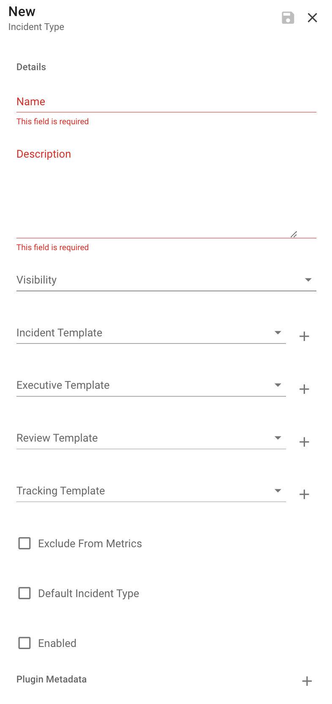

# Configuration

Make Dispatch yours! Below you will find documentation surrounding the configuration options available to you and what they mean for the incident process.

## Incident Types

Dispatch allows you to define your own incident types. These are used to bucket or categorize your incidents and map various other Dispatch resources (e.g. services and individuals) to these types.

To create a new incident type navigate to: `Dispatch > Incident Types > New`

**Name:** The name of the incident type presented to the user.

**Description:** The description of the incident type presented to the user.

**Visibility:** Determines whether to send notification messages about this incident on creation and update. On incident close, this setting will add an organization-wide permission to incident resources. Defaults to 'Open'.

**Service:** Defines the oncall service to use to resolve an incident commander. The incident commander defaults to the `reporter` if no oncall service is defined.

**Document:** Allows you to specify an incident document template to be created and filled for this incident type. This is useful if you like to use different document templates depending on the type of incident.

**Exclude From Metrics:** Enable this setting to exclude all incidents of this type from metrics (e.g. "Simulation" or "Test" incidents).

**Default Incident Type:** If the reporter of an incident does not provide an incident type, a default incident type will be used. Enable this setting to make this incident type the default.

## Incident Priorities

In addition to incident types, Dispatch allows you to specify the incident's _priority_.

To create a new incident priority, navigate to: `Dispatch > Incident Priorities > New`

**Name:** The name of the incident priority presented to the user.

**Description:** The incident priority description presented to the user when reporting.

**View Order:** The ranked order which the priority should be listed in menus and dropdowns.

**Tactical Report Reminder:** Number of hours between reminders.

**Executive Report Reminder:** Number of hours between reminders.

**Default Incident Priority:** If the reporter of an incident does not provide an incident priority, a default will be used. Enable the setting to make this incident priority the default.

**Page Commander:** Ensures that the incident commander is paged for all incidents with this priority (if configured paging service and plugin allows).

## Plugins

Much of Dispatch's functionality comes from its plugins. The configuration UI is limited to enabling and disabling plugins. By default, no plugins are _required_ in order to create an incident. As you enable plugins, they will be additive to the incident process (e.g. creating slack channels, google docs etc.)

Looking to add your own functionality to Dispatch via plugins? See the [contributing](../../contributing/plugins/README.md) documentation.

## Workflows

Workflows allows you to extend Dispatch, invoking your own response automation. Dispatch does not currently include the ability to author workflows directly. Instead, the workflow functionality allows for existing workflows to be invoked from Dispatch. We rely on external workflow orchestration tools to execute those workflows, with Dispatch keeping track of resulting artifacts and workflow status.

To create a new incident workflow navigate to: `Dispatch > Workflows > New`

**Name:** The name you wish to present to the user.

**Description:** The description presented to the user when the workflow is viewed.

**Resource Id:** The _external_ resource id used by Dispatch to associate the workflow with an external system.

**Plugin:** The plugin to use to resolve and execute this workflow. NOTE: This plugin must be enabled and installed before being associated with workflow.

**Enabled:** By default, users can't invoke workflows. Activate the "Enabled" setting to allow use of the workflow.

**Workflow Parameters:** Allows for custom parameters (strings only) to be presented to and set by the user. These will then be passed to the underlying workflow.

## Users

Users represent users of the Dispatch UI and are different from individual contacts or incident participants. These user accounts are used to control access to the Dispatch UI only. We do not currently support creation or removal of users via the Dispatch UI, except in the case of self registration.

**Role:** Dispatch uses role based access control (RBAC) for its UI. Currently, this is only used to protect sensitive (Visibility: Restricted) incidents. We do not currently have any controls surrounding Dispatch configuration and settings.

There are three roles defined by Dispatch:

- Admin - allows full access to the Dispatch UI and all incidents whether their visibility is open or restricted.
- Poweruser - currently the same as Admin.
- User - can access everything except restricted incidents unless they are a direct participant.
