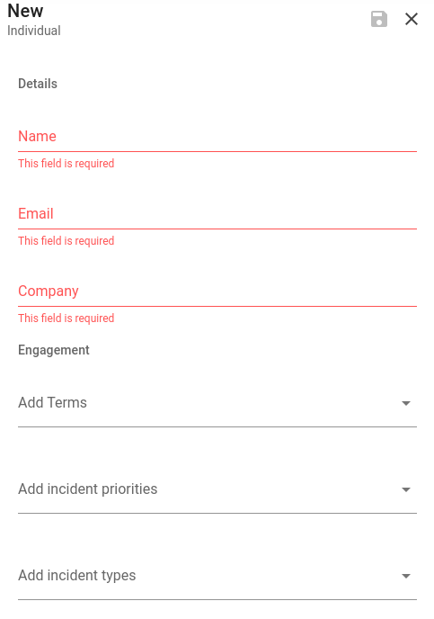
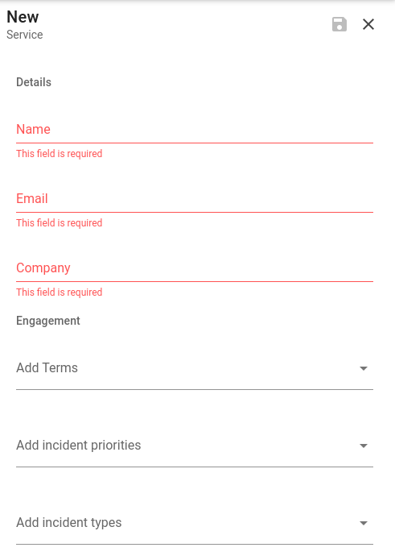
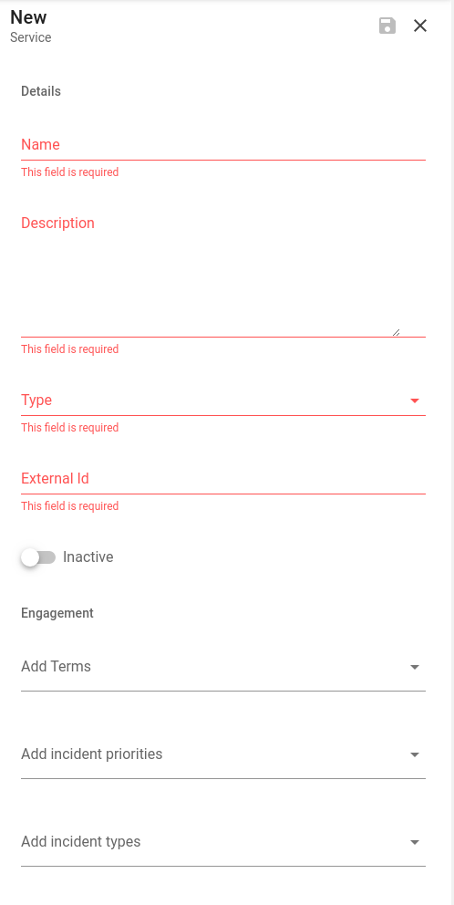

# Contacts

## Individual

In Dispatch, Individuals are either internal or external people identifiers. Typically, an organization will have a robust internal whitepages/phone-book. Dispatch does not expect to replace those data stores. Instead, it keeps a lightweight notion of identities to associate with incidents for filtering and metrics.

Everyone has a spreadsheet somewhere of who to contact for a given incident. With individual contacts Dispatch allows for that data to useful by pulling those individuals directly into incident. By assigning terms, incident types or incident priorities to individuals, Dispatch is able to directly add them to the incident \(if internal\) or suggest reaching out to them \(if external\).

To create a new individual contact navigate to: `Dispatch > Individuals > New`

**Name:** Name of the individual.

**Email:** Email address associated with the individual.

**Company:** Company that is associated with the individual.

#### Engagement

In addition to fields about the individual, Dispatch allows you to associate the individual with other Dispatch primatives. For instance, if you would like to involve an individual for all incidents of a given priority, associate that priority with the individual.

## Team

Like `Individuals`, there are often groups of individuals (teams) that need to be engaged and/or notified during an incident. With teams, Dispatch manages those groups \(typically, team distribution lists\) providing a centralized datastore for that contact data.

To create a new team contact navigate to: `Dispatch > Teams > New`

**Name:** Name of the team.

**Email:** Email addresses associated with the team.

**Company:** Company that is associated with the team.

#### Engagement

In addition to fields about the team, Dispatch allows you to associate a team with other Dispatch primatives. For instance, if you would like to involve an entire team for all incidents of a given priority, associate that priority with the team.

## Service

Similar to `Teams` there are often groups of individuals (teams) responsible for an application or service which need to be involved in an incident. However, in these circumstances we don't want to engage the _whole_ team. We only want to engage the individual that is oncall for the service. `Services` allow Dispatch to resolve these individuals via third-party schedules (e.g. PagerDuty).

To create a new team contact navigate to: `Dispatch > Services > New`

**Name:** Name of the service.

**Description:** Description of the service.

**Plugin:** The associated service plugin that Dispatch will use to resolve an individual.

**External Id:** The external ID that will be used by Dispatch and the defined plugin to resolve an individual.

**Enabled:** Flag that determines if this particular service is active.

#### Engagement

In addition to fields about the service, Dispatch allows you to associate the service with other Dispatch primatives. For instance, if you would like to involve a service for all incidents of a given priority, associate that priority with the service.
