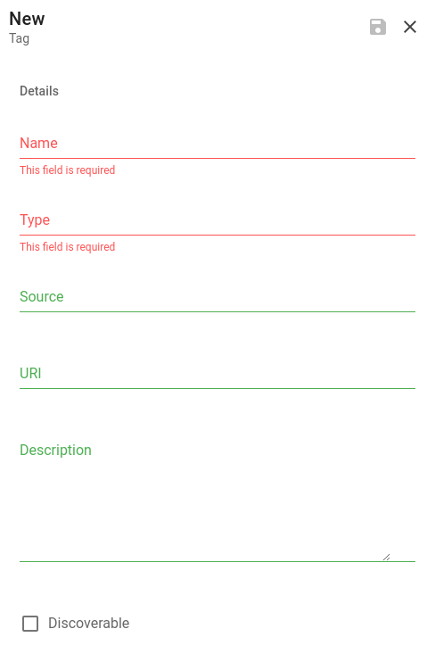
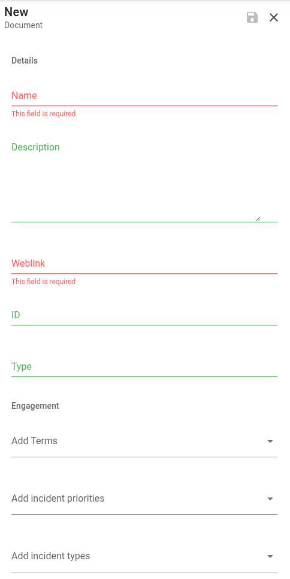

# Knowledge

Along with incident orchestration, Dispatch is adept at building a knowledge base of incident data. Below we outline the primitives at your disposal and describe how you can manually add to the incident knowledge base.

## Tags

Within Dispatch, tags are a flexible piece of metadata. They can be manually attached to incidents or automatically discovered based on incident data.

To create a new tag navigate to: `Dispatch > Tags > New`

**Name:** The tag string itself, or what you would expect to be in incident data.

**Description:** A short description of the tag (if applicable).

**Type:** The _type_ of the tag and is used to disambiguate or categorize. These are defined either by a plugin syncing tags from external sources (e.g., application names) or are user-definable.

**Source:** Where the tag originated. For tags created via the UI, Dispatch is the default source.

**URI:** The external tag locator (if available).

**Discoverable:** Dispatch can automatically discover tags. Meaning given a set of predefined tags, it will crawl all incident data available to it and, using NLP, associate this data to incidents (current incident and retroactively). If a tag is general enough (e.g., "the") that you do not want to make it discoverable, this flag can disable that functionality on an individual tag basis.

## Documents

To create a new document navigate to: `Dispatch > Documents > New`

Documents are links to external sources \(Web Pages, Google Documents, etc.,\). These documents can be associated with terms, incident types, and incident priorities, allowing these documents to be recommended reading for incident participants.

If you use the Google Drive plugin, Dispatch will copy a Google document associated with an incident type into a folder. Make sure you specify the correct Google Docs ID for the `ID` field.

**Name:** Name of the document.

**Description:** Short description of the document.

**Weblink:** A hyperlink representing the document.

**ID:** The external ID that is used to fetch the document.

**Type:** A user-defined document type.

### Incident Templates

Documents can also be used as templates during incident creation that Dispatch will attempt to fill.

If you are using the Google Drive plugin, we provide a set of templates to get you started. These should be copied into your Google Drive and then created as documents in the Dispatch UI.

- [Incident Document](https://docs.google.com/document/d/1fv--CrGpWJJ4nyPR0N0hq4JchHJPuqsXN4azE9CGQiE)

- [Incident Review Document](https://docs.google.com/document/d/1-VwcEpVVdymoojdUg9e5XP8QGam0-B5Djxh-guuPpEc)

- [Executive Report](https://docs.google.com/document/d/1dab6k14p5ageo5B_d1YlB_zS9hMGHDMXy9RUbIZous4)

- [Incident Tracking Sheet](https://docs.google.com/spreadsheets/d/1Odk4KlL7uMF_yd7OvTOCaPWmtTA_WzFBIA4lMeU5cGY)

### Template variables

The following is a list of available variables that Dispatch will attempt to resolve on document creation (we do not currently re-resolve these).

NOTE: All variables must be enclosed in a `{{}}`

- `name` - The name of the incident
- `description` - The incidents description
- `title` - The incidents title
- `commander_fullname` - The current commanders name
- `type` - The incident type name
- `prioritity` - The incident priority name
- `status` - The incidents status
- `conversation_weblink` - Link to the conversation resource (if any)
- `conference_weblink` - Link to the conference resource (if any)
- `storage_weblink` - Link to the storage resource (if any)
- `document_weblink` - Link the incident document (if any)
- `ticket_weblink` - Link the incident ticket (if any)

#### Engagement

In addition to fields about the document itself, Dispatch allows you to associate a document with other Dispatch primitives. For instance, if you would like a given document to be recommended for all incidents of a given priority, associate that priority with the document.

#### Evergreen

Enabling evergreen for a document instructs Dispatch to send an email reminder to the document owner, informing them that they should check to ensure that the document in question is up to date.

## Terms

Terms are words or phrases that may not have any meaning to an outside observer but have deep organizational meaning (e.g., acronyms and names).

As an example, take the term PCI. In the security world, this acronym typically refers to the Payment Card Industry security standard.

Any defined term can be associated with Teams, Services, or Individuals for incident inclusion.

## Definitions

Definitions collect and manage term definitions from various sources; this enables incident participants to understand the language and terms used throughout an incident.

A definition can be associated with one or more terms \(in case of term overload\).
