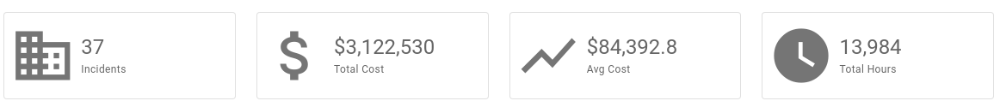
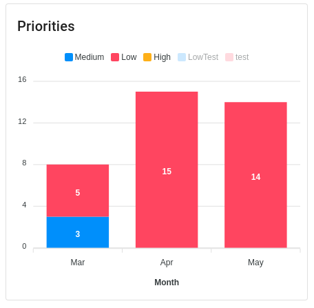
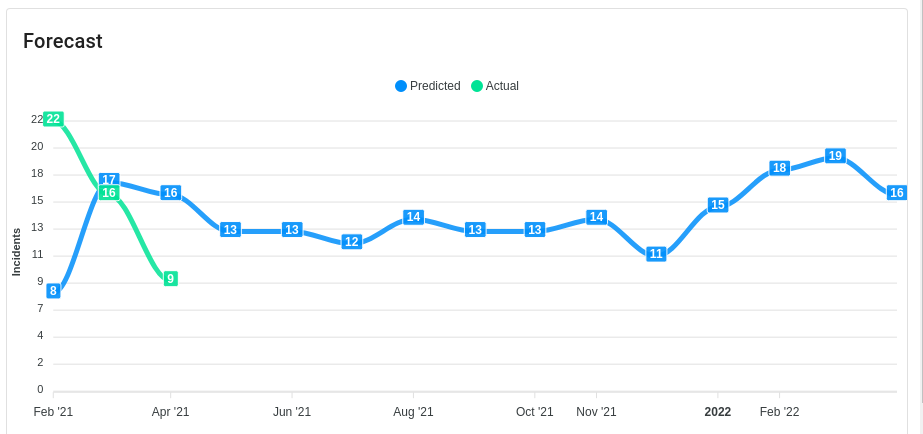

# Dashboard

Dispatch provides basic dashboarding and reporting functionality that allows users to understand how incidents impact their organization. It comes preconfigured with useful aggregations like the number of incidents by type and priority.

Additionally, all of the dashboard graphs are dynamic. This dynamism allows us to identify interesting subsets of data by filtering by different incident facets.

Some key incident graphs:

## Aggregated top-line metrics

These metrics are aggregated across all currently filtered incidents.

## Breakdown on key incident facets

### By Incident Type

### By Incident Priority

## Forecasting

Dispatch has the ability to do some _simple_ forecasting. It looks at prior incident history and applies [Exponential Smoothing](https://machinelearningmastery.com/exponential-smoothing-for-time-series-forecasting-in-python/#:~:text=Exponential%20smoothing%20is%20a%20time%20series%20forecasting%20method%20for%20univariate%20data.&text=Exponential%20smoothing%20forecasting%20methods%20are,decreasing%20weight%20for%20past%20observations) to guess how many incidents will be encountered in the future.

This works okay for small incident loads but becomes better with more incidents. If there isn't enough data to make a reasonable forecast one will not be displayed in the UI.

An example forecast:

