# Incident Commander

## Reporting

Within Dispatch, Incident Commanders \(ICs\) are also participants, and will receive all of the participant messaging as well. When resolved as the Incident Commander, you are assigned that role by Dispatch, and your identity is propagated via various messaging.

All Slack commands are listed below, or you may view _groups_ of commands relating to [People](#people), [Communications](#communications), [Tasks](#tasks), and [Incident Resources & Metadata](#incident-resources-and-metadata).

## All Slack commands

- [`/dispatch-add-timeline-event`](#%2Fdispatch-add-timeline-event)
- [`/dispatch-assign-role`](#%2Fdispatch-assign-role)
- [`/dispatch-engage-oncall`](#%2Fdispatch-engage-oncall)
- [`/dispatch-list-my-tasks`](#%2Fdispatch-list-my-tasks)
- [`/dispatch-list-participants`](#%2Fdispatch-list-participants)
- [`/dispatch-list-resources`](#%2Fdispatch-list-resources)
- [`/dispatch-list-tasks`](#%2Fdispatch-list-tasks)
- [`/dispatch-list-workflows`](#%2Fdispatch-list-workflows)
- [`/dispatch-list-incidents`](#%2Fdispatch-list-incidents)
- [`/dispatch-notifications-group`](#%2Fdispatch-notifications-group)
- [`/dispatch-report-executive`](#%2Fdispatch-report-executive)
- [`/dispatch-report-incident`](#%2Fdispatch-report-incident)
- [`/dispatch-report-tactical`](#%2Fdispatch-report-tactical)
- [`/dispatch-update-incident`](#%2Fdispatch-update-incident)
- [`/dispatch-update-participant`](#%2Fdispatch-update-participant)
- [`/dispatch-run-workflow`](#%2Fdispatch-list-workflow)

## People

These commands help manage the people helping resolve the incident.

### /dispatch-assign-role

Anyone helping run an incident may play various roles. For example, you may have a scribe, or an executive liaison, or you may hand off the incident to a new Incident Commander. At any of these times, use `/dispatch-assign-role` to easily assign a role to any individual.

It's especially important to use this command when handing off responsibility for incident leadership. Doing so will help avoid any confusion about the identity of the current Incident Commander.

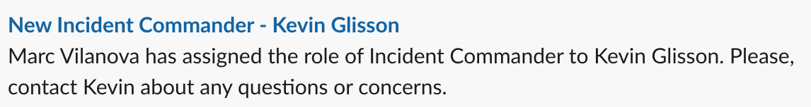

### /dispatch-engage-oncall

You'll need the help of various teams to resolve an incident. To quickly engage an on-call member of another team, use `/dispatch-engage-oncall` to resolve their identity, and optionally page them.

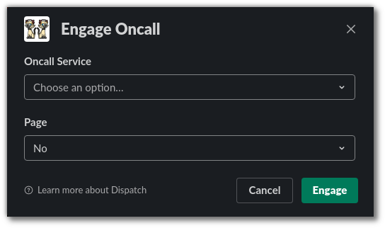

### /dispatch-list-participants

Use this command to determine which teams and individuals are engaged in the incident. The output looks like this:

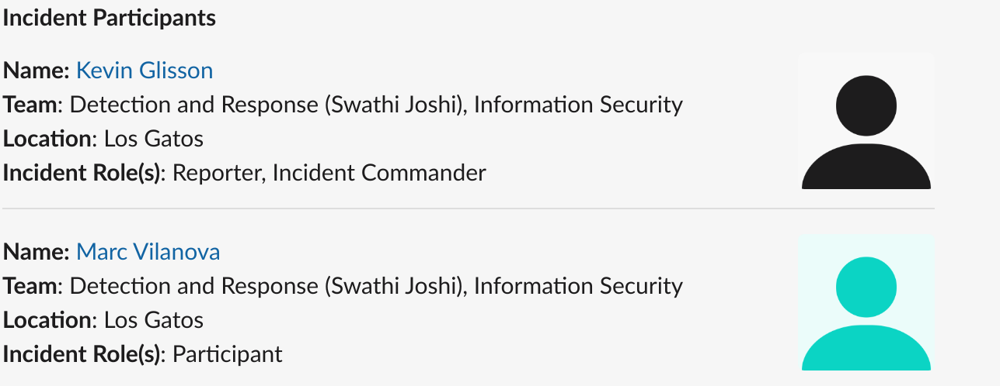

### /dispatch-update-participant

Participants in an incident, or the Incident Commander, may want to know a participant's area of expertise or their expected contribution to resolving an incident. Use `/dispatch-update-participant` to update the reason a participant was added. The dialog appears like this:

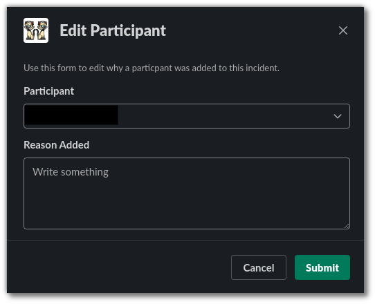

## Communications

These commands help manage incident communications.

### /dispatch-notifications-group

An incident notifications group consists of individuals or distribution lists. Manage this group by using `/dispatch-notifications-group`.

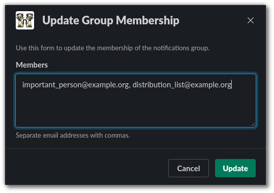

### /dispatch-report-executive

Many stakeholders may be invested in the progress of an incident, but aren't expected to be involved on a tactical level. For example, your Chief Financial Officer may want to know of an ongoing security incident regarding financial data, but should never be involved on a tactical level (directing participants or actions). To keep external stakeholders such as these informed, use `/dispatch-report-executive` to build and distribute a high-level report.

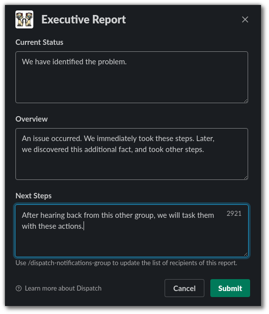

### /dispatch-report-incident

Use `/dispatch-report-incident` to report a new incident.

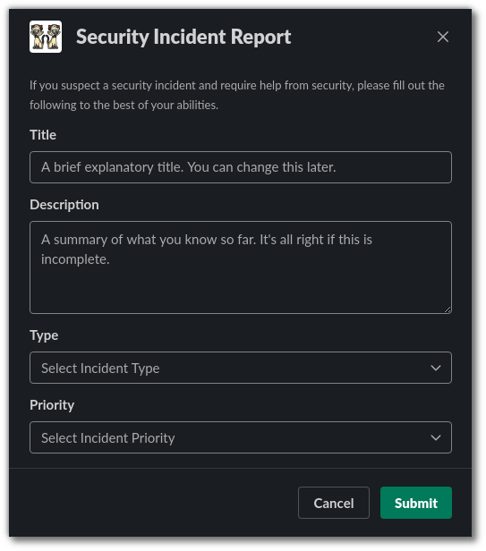

### /dispatch-report-tactical

Regular tactical reports, such as using the Conditions, Actions, and Needs (CAN) format, are critical to keep your participants well-informed. Use `/dispatch-report-tactical` to easily create these.

The report form will appear like this:

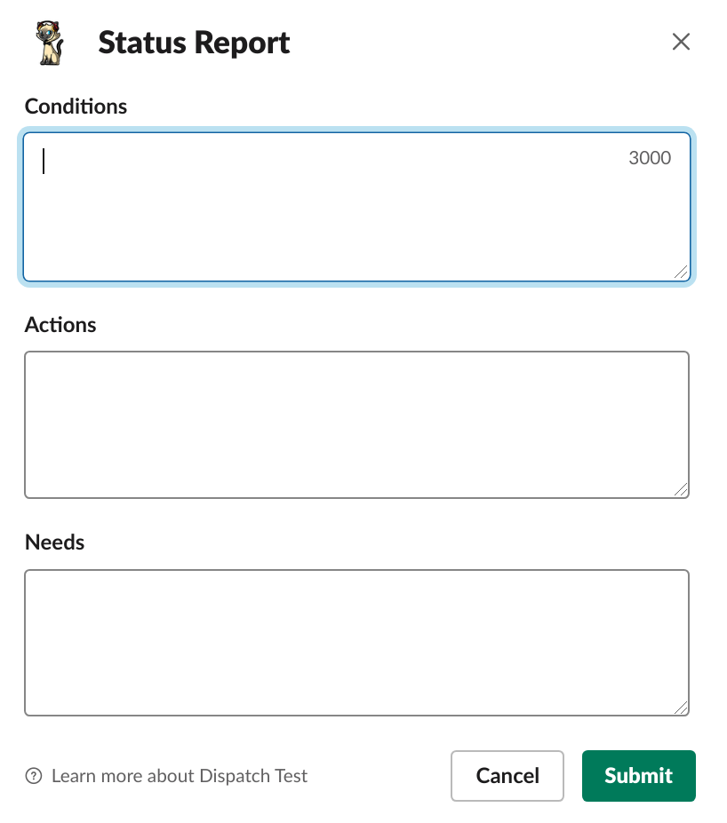

The output in the Slack channel will appear like this:

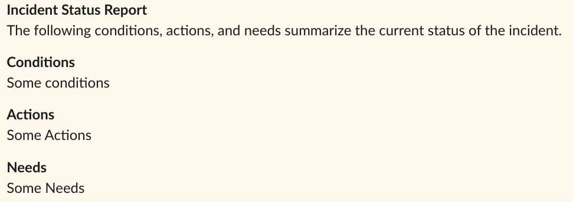

## Tasks

Dispatch provides a lightweight bridge between Google Docs comments that are assigned as tasks, and your incident Slack channel.

It looks like this, in the Incident Document:

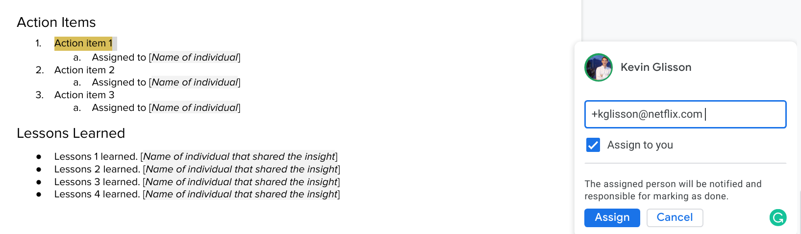

The following commands help manage these tasks associated with an incident.

### /dispatch-list-my-tasks

Any individual who issues the `/dispatch-list-my-tasks` command will see a list of tasks created by or assigned to them.

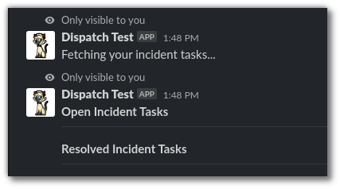

### /dispatch-list-tasks

Use `/dispatch-list-tasks` to display an ephemeral message listing all tasks associated with the incident.

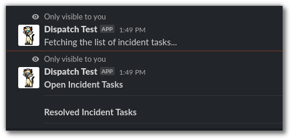

## Incident resources and metadata

These commands help manage incident resources and metadata (data about the incident).

### /dispatch-update-incident

This command allows the IC to modify several aspects of the incident without ever leaving the conversation interface.

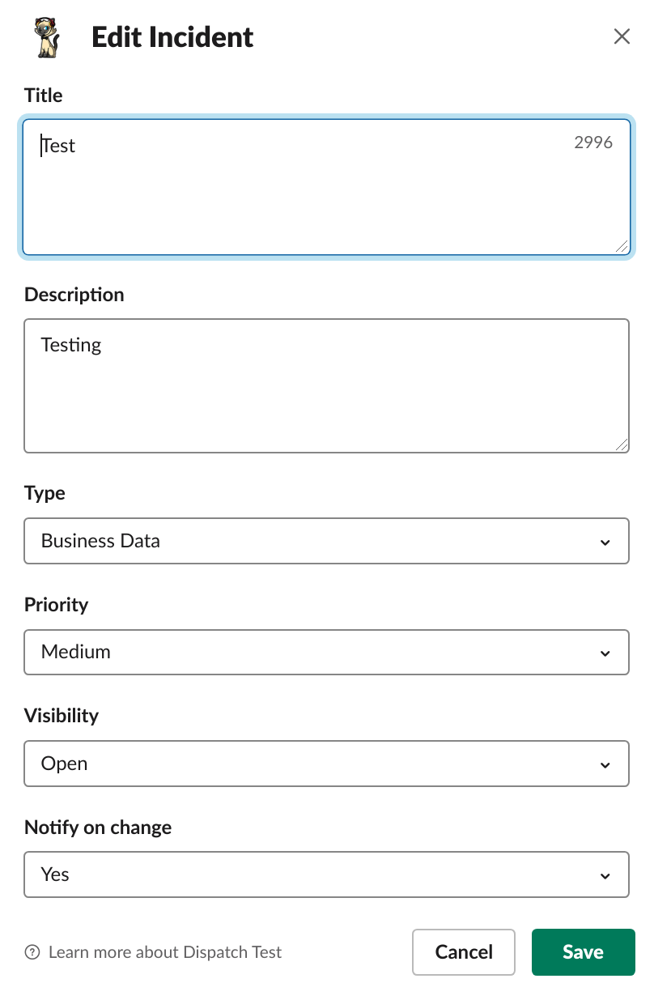

### /dispatch-add-timeline-event

This command helps you add an event to the incident timeline. You may use local time (derived from your Slack profile), or Coordinated Universal Time (UTC).

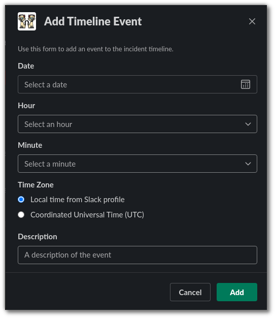

### /dispatch-list-workflows

This command will list all workflows associated with the current incident.

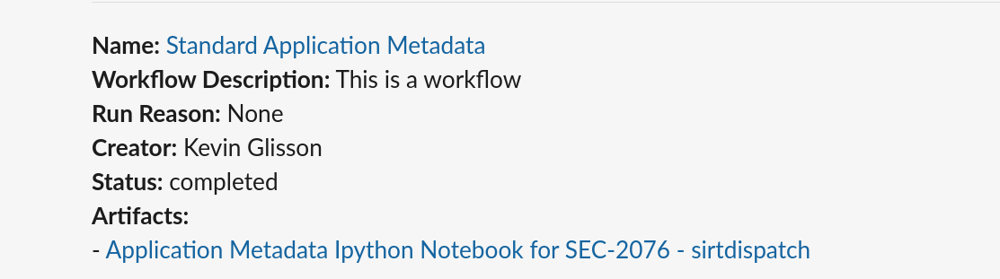

### /dispatch-run-workflow

This command will run a pre-configured workflow and associate its artifacts with the current incident.

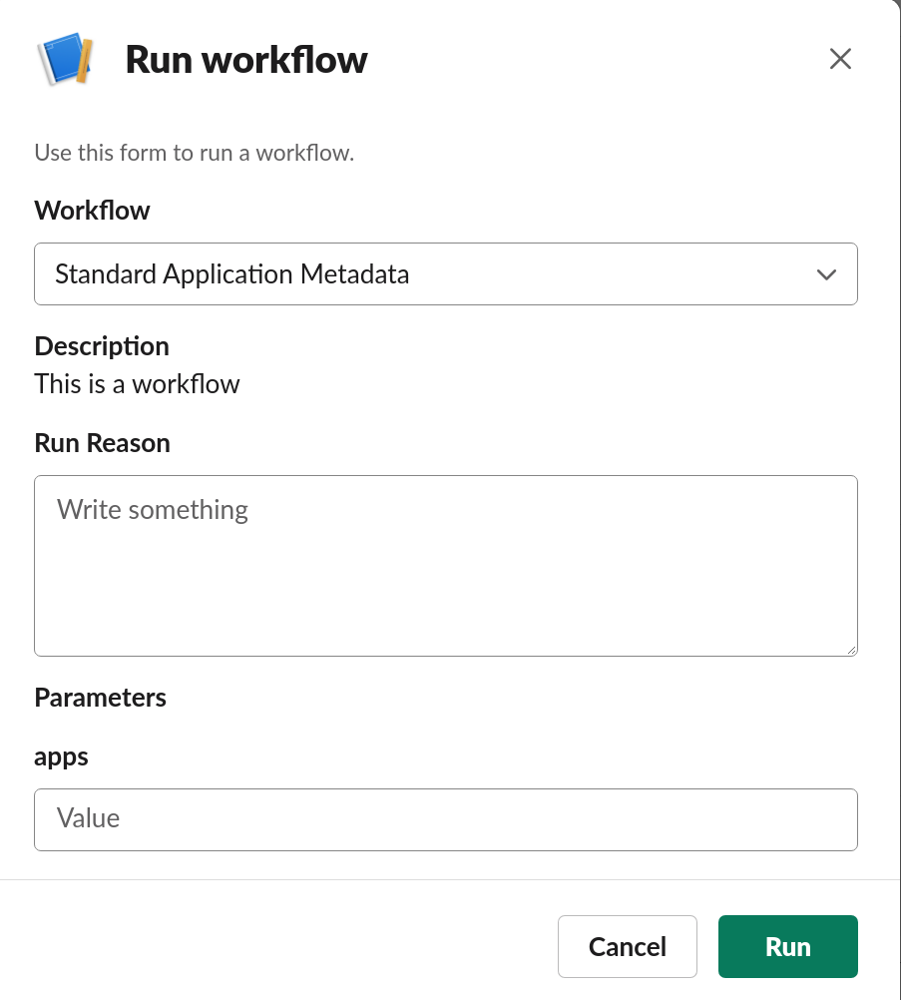
